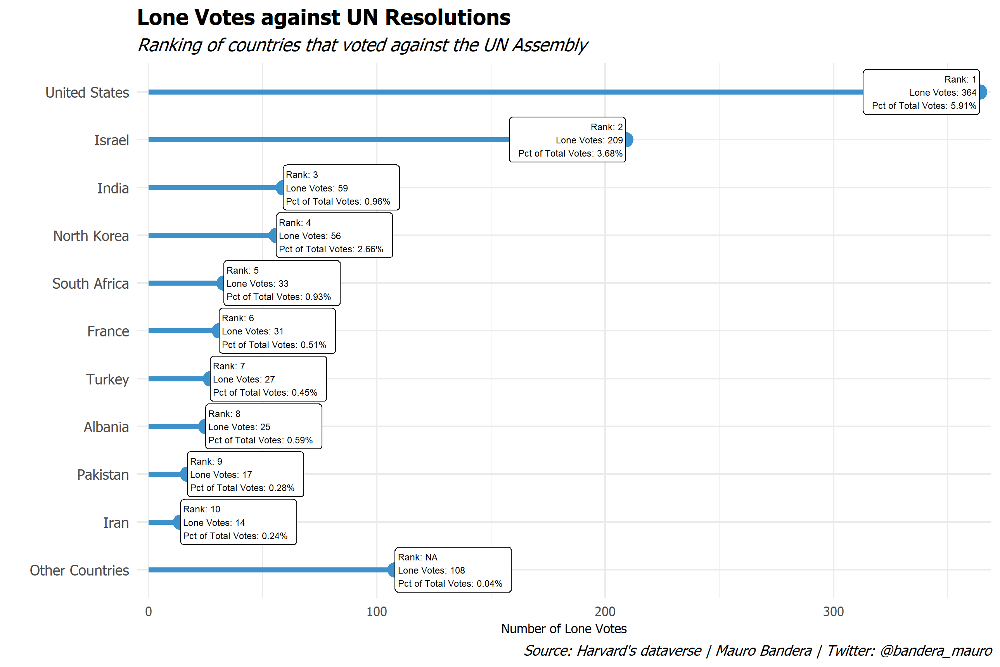
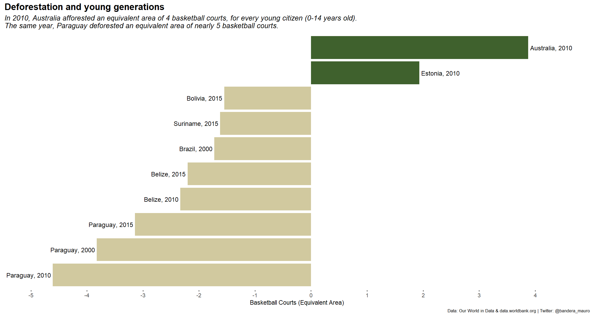
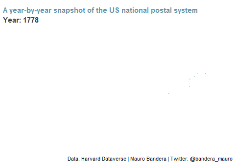

# tidytuesday

This repo is a collection of my #TidyTuesday code and visualisations.
#TidyTuesday is a project organized by the `R4DS Online Learning Community`, that emphasize on understanding how to summarize, arrange and visualize data by leveraging the tools available in the `tidyverse` ecosystem. 

#### 2021 Week 13 - UN Votes
Using the data from [Harvard's Dataverse](https://dataverse.harvard.edu/dataset.xhtml?persistentId=hdl:1902.1/12379): "United Nations General Assembly Voting Data", I focused on lone votes, to explore how many times a country stood alone at the United Nations.

Source code [here](R_code/TT2021W13_unvotes.R)

#### 2021 Week 15 - Deforestation
This week TidyTuesday was about Forest and Deforestation. The data comes from [Our World in Data](https://ourworldindata.org/forests-and-deforestation): Hannah Ritchie and Max Roser (2021) - "Forests and Deforestation".
I used the data about Net forest conversion in every countries, and joined them with their young population data from the [Data World Bank](https://data.worldbank.org/indicator/SP.POP.0014.TO), trying to spot some curious details.

Source code [here](R_code/TT2021W15_forest.R)

#### 2021 Week 16 - US Post Offices
This week data come from: "Blevins, Cameron; Helbock, Richard W., 2021, "US Post Offices", https://doi.org/10.7910/DVN/NUKCNA, Harvard Dataverse, V1, UNF:6:8ROmiI5/4qA8jHrt62PpyA== [fileUNF]"

> US Post Offices is a spatial-historical dataset containing records for 166,140 post offices that operated in the United States between 1639 and 2000. The dataset provides a year-by-year snapshot of the national postal system over multiple centuries, making it one of the most fine-grained and expansive datasets currently available for studying the historical geography of the United States.

Their website has more details:  

- [US Post Offices](https://cblevins.github.io/us-post-offices/)

I never used `gganimate` before, so I challenged myself trying to reproduce the animation from the website:

Source code [here]()

